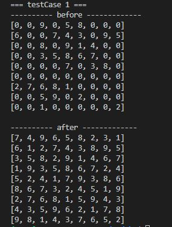

Sudoku solving program 
======================

### Usage
> 1. open input.txt
> 2. enter your uncrackable sudoku following under instructions
>```
>	1. first line is num of test case
>	2. under 9 lines are present its sudoku
>	3. so on..
>```
> 3. example
>
> >  		


